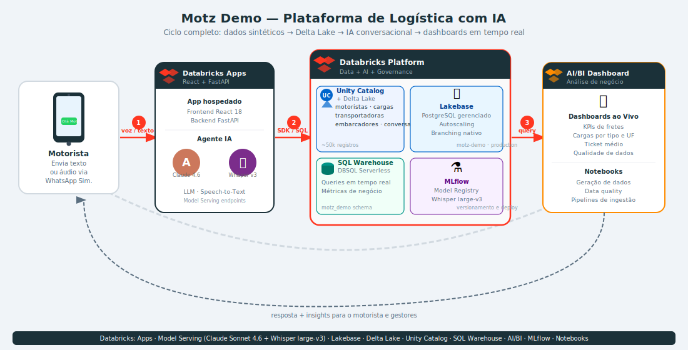
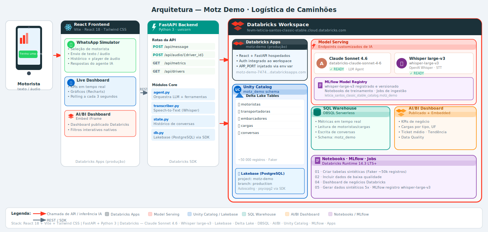

# Motz Demo — Logística de Caminhões

Plataforma estilo "Uber de caminhões": conecta **embarcadores** (quem precisa enviar carga) e **transportadores** (motoristas/transportadoras), com um agente de IA conversacional via WhatsApp simulator.

---

## Visão Geral (CIO)



---

## Arquitetura Técnica



> **Stack completo:** React 18 + Vite + Tailwind CSS · FastAPI + Python 3 · Databricks (Claude Sonnet 4.6, Whisper large-v3, Lakebase, Delta Lake, DBSQL, AI/BI, Unity Catalog, MLflow, Apps)

---

## Componentes

### Frontend — React (Vite)
| Painel | Descrição |
|--------|-----------|
| **WhatsApp Simulator** | Simula conversa de motorista com o agente IA — texto e áudio (gravação + player) |
| **Live Dashboard** | KPIs e gráficos ao vivo consumindo `/api/metrics`, polling a cada 3s |
| **AI/BI Dashboard** | Dashboard Databricks embeddado via iFrame (`embed_credentials`) |

### Backend — FastAPI (`app/backend/main.py`)
| Rota | Método | Descrição |
|------|--------|-----------|
| `/api/message` | POST | Processa mensagem de texto → agente LLM |
| `/api/audio/{driver_id}` | POST | Transcreve áudio → agente LLM |
| `/api/metrics` | GET | Métricas ao vivo via Lakebase |
| `/api/drivers` | GET | Lista motoristas do Lakebase |
| `/api/state/{driver_id}` | GET | Histórico de conversa |
| `/api/state` | DELETE | Reseta conversas |

### Core (`app/core/`)
| Módulo | Responsabilidade |
|--------|-----------------|
| `agent.py` | Orquestrador LLM — ferramentas de consulta a cargas, motoristas e estado |
| `transcriber.py` | Speech-to-Text via endpoint `whisper-large-v3` |
| `state.py` | Histórico de conversas (leitura/escrita na tabela `conversas`) |
| `db.py` | Conexão ao Lakebase (PostgreSQL) via Databricks SDK |

### Databricks Workspace
| Serviço | Recurso |
|---------|---------|
| **Databricks Apps** | `motz-demo` — hospeda React + FastAPI em produção |
| **Model Serving** | `databricks-claude-sonnet-4-6` (LLM Agent) |
| **Model Serving** | `whisper-large-v3` (STT — OpenAI Whisper) |
| **Lakebase** | PostgreSQL gerenciado — project `motz-demo`, branch `production` |
| **Unity Catalog** | `leticia_santos_classic_stable_catalog.motz_demo` |
| **Delta Lake** | `motoristas`, `transportadoras`, `embarcadores`, `cargas`, `conversas` |
| **SQL Warehouse** | DBSQL Serverless — queries ao vivo |
| **AI/BI Dashboard** | Dashboard publicado com `embed_credentials` |
| **MLflow** | Registry do modelo whisper-large-v3 |

---

## Tabelas Delta Lake

| Tabela | Descrição |
|--------|-----------|
| `transportadoras` | Cadastro de transportadoras (CNPJ, frota, contatos) |
| `motoristas` | Motoristas vinculados a transportadoras (CNH, veículo, localização) |
| `embarcadores` | Contratantes de frete (CNPJ, contatos) |
| `cargas` | Fretes: realizados, disponíveis e futuros — liga embarcador × transportadora × motorista |
| `conversas` | Histórico de mensagens do agente IA por motorista |

---

## Workspace Databricks

- **URL:** [fevm-leticia-santos-classic-stable.cloud.databricks.com](https://fevm-leticia-santos-classic-stable.cloud.databricks.com/)
- **App:** [motz-demo-7474658265676932.aws.databricksapps.com](https://motz-demo-7474658265676932.aws.databricksapps.com)
- **Org ID:** `7474658265676932`
- **Catalog / Schema:** `leticia_santos_classic_stable_catalog.motz_demo`

---

## Rodando o App

### Pré-requisitos
- Databricks CLI autenticado (`databricks auth login`)
- Python 3.10+ e Node 18+

### 1. Backend (FastAPI)

```bash
cd app
pip install -r requirements.txt
uvicorn backend.main:app --reload --port 8000
```

### 2. Frontend (React)

```bash
cd app/frontend
npm install
npm run dev       # http://localhost:5173
```

O Vite proxeia `/api/*` → `http://localhost:8000`.

---

## Notebooks

| Notebook | Descrição |
|----------|-----------|
| `01_criar_tabelas_sinteticas.py` | Cria e popula as tabelas com Faker (~50 000 registros) |
| `02_incluir_dados_qualidade_ruim.py` | Injeta registros com problemas de qualidade |
| `04_dashboard_negocios_databricks.py` | Dashboard nativo Databricks AI/BI |
| `05_gerar_dados_sinteticos_5x.py` | Geração de volume maior de dados |

### Executar notebook no Databricks

1. Runtime **14.3 LTS** ou superior
2. Instale no cluster: `faker`
3. Ajuste `catalog` e `schema` nas variáveis do topo
4. Execute todas as células

---

## Estrutura do Repositório

```
demo-logistic/
├── README.md
├── docs/
│   ├── architecture.svg              # Diagrama técnico detalhado
│   ├── architecture-cio.svg          # Diagrama alto nível (CIO)
│   ├── databricks-workspace.md
│   ├── data_quality_rules.md
│   └── storytelling_genie_motz_demo.md
├── app/
│   ├── app.yaml                      # Databricks Apps config
│   ├── start.sh                      # Entrypoint (APP_PORT)
│   ├── backend/
│   │   └── main.py                   # FastAPI — rotas da API
│   ├── core/
│   │   ├── agent.py                  # Orquestrador LLM (Claude)
│   │   ├── transcriber.py            # STT (Whisper large-v3)
│   │   ├── state.py                  # Histórico de conversas
│   │   └── db.py                     # Lakebase via Databricks SDK
│   ├── frontend/
│   │   └── src/
│   │       └── pages/Demo.jsx        # App principal React
│   └── requirements.txt
├── notebooks/
│   ├── 01_criar_tabelas_sinteticas.py
│   ├── 02_incluir_dados_qualidade_ruim.py
│   ├── 04_dashboard_negocios_databricks.py
│   └── 05_gerar_dados_sinteticos_5x.py
├── scripts/
└── databricks.yml
```
